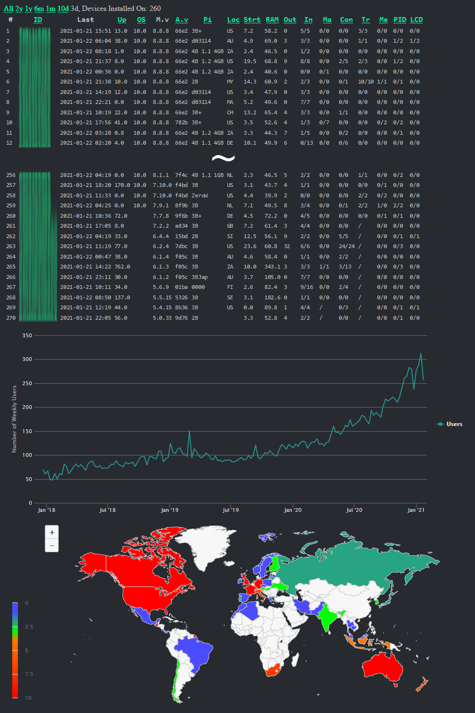

## Mycodo Anonymous Statistics Viewer

Version: 1.2.0

#### For use with [Mycodo](https://github.com/kizniche/Mycodo)

This is not meant for public use (as my server stores the data and is only readable by myself). It is here to demonstrate how the statistics data is viewed and as a backup to preserve the source code in case of data loss.

